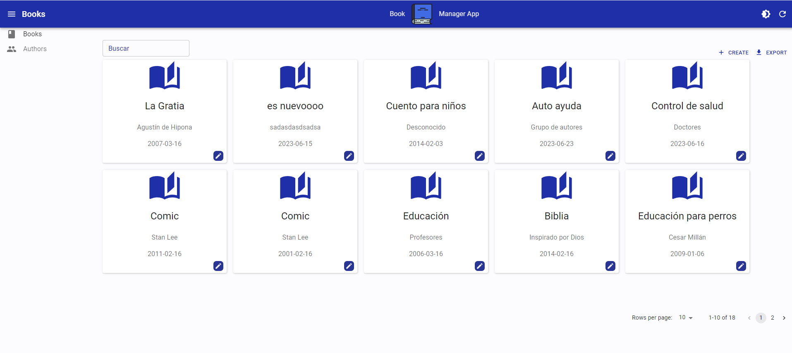
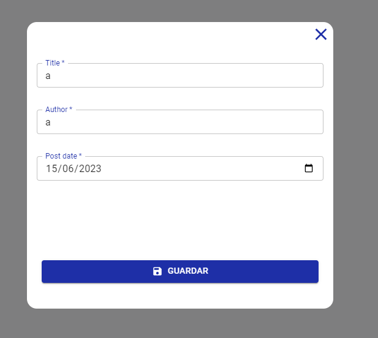
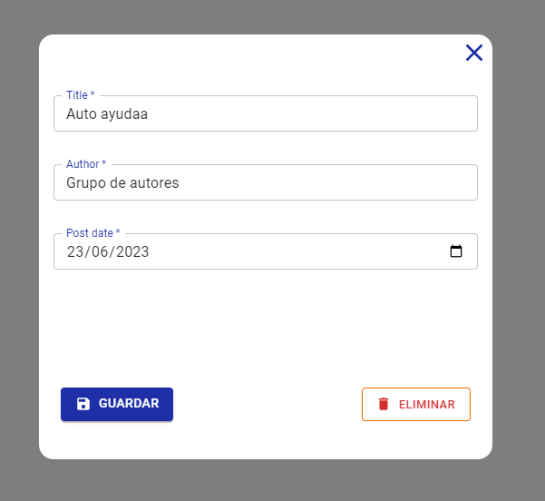
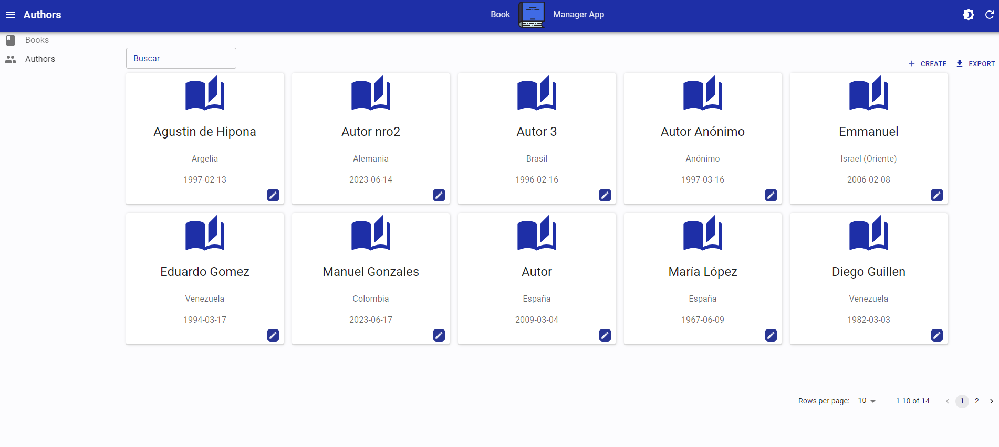
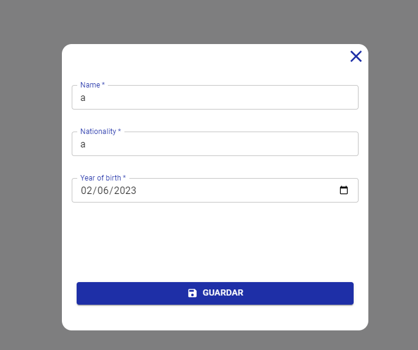
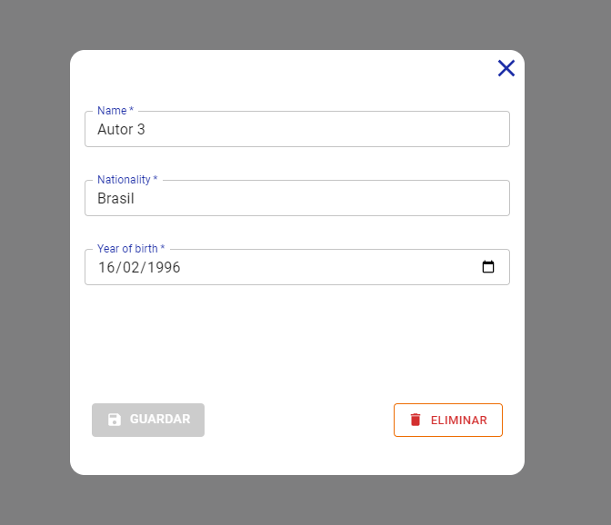
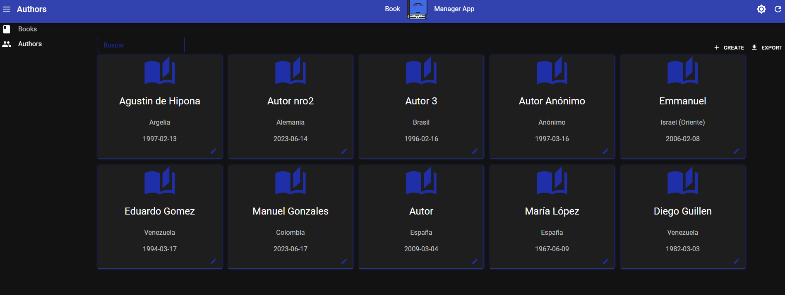
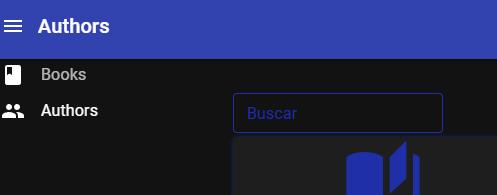

# book-manager-app

## Configuración inicial:
En el archivo `.env_example` tiene un ejemplo sobre la variable de entorno que se debe usar.
De igual forma les dejo un ejemplo: `VITE_JSON_SERVER_URL=http://localhost:3001`

nota: el valor de su variable de entorno debe coincidir con la bandera `--port` del siguiente script de su package.json, 
`"serverAPI": "json-server --watch db.json --port 3001"`, sin embargo, puede escribir el puerto que desee.

### `npm run dev` le permitirá correr el administrador
### `npm run serverAPI` le permitirá correr json-server

## Decripción

`book-manager-app` tiene la capacidad de gestionar libros y autores, cada gestión cuenta con su propio apartado:

### `Apartado de Libros`

#### Cuenta con el listado de libros y filtrado de busqueda para cualquier campo (`titulo, autor  o fecha de publicación`)

#### Modal para crear

### Modal para editar y eliminar

### `Apartado de Autores`

#### Cuenta con el listado de autores y filtrado de busqueda para cualquier campo (`nombre, nacionalidad  o año de nacimiento`)

#### Modal para crear

### Modal para editar y eliminar

## Mejoras

### Se añadió modo dark como una de las mejoras

### Por último, aunque ya fué mencionado, se implementó un input para buscar cualquier campo disponible, mencionados anteriormente.

# Gracias por su atención, Saludos 👋🏼